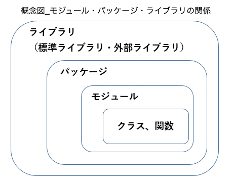

# Pythonの基礎知識についてまとめる
## モジュールとは
- **モジュールとは、Pythonのファイル（.py）のこと**
  - Pythonである程度の長いプログラムを書く場合などは、Jupitor Notebookやコマンドラインではなく .pyファイルに実行したい内容を保存します。
  - そしてその保存された .pyファイルは、他のPythonのプログラムからimportで呼び出して使うこともできます。これをモジュールと呼びます。通常、このモジュールの中には、いくつかのクラスや関数が含まれています。
  - **モジュールをいくつか集めてまとめたものがパッケージ**と呼ばれています。

## ライブラリとは
- ライブラリとは、**いくつかのパッケージをまとめてひとつのライブラリとしてインストールできるようにしたもの**
  - ライブラリには、Pythonに付属していてすぐに使える標準ライブラリと、ダウンロードなど追加インストールをしてから利用する外部ライブラリがあります。
  - 科学技術計算でよく使われるNumPy（ナンパイ）やグラフ描画に使われるMatplotlib（マットプロットリブ）、データ解析を支援する機能を提供するPandas（パンダス）などはすべてライブラリという形で配布されています。

## 概念図

## 補足
### 参考文献
- [Pythonのよく使うライブラリ一覧！一段上の開発を目指そう](https://and-engineer.com/articles/YJjVUREAABL1ZVii)